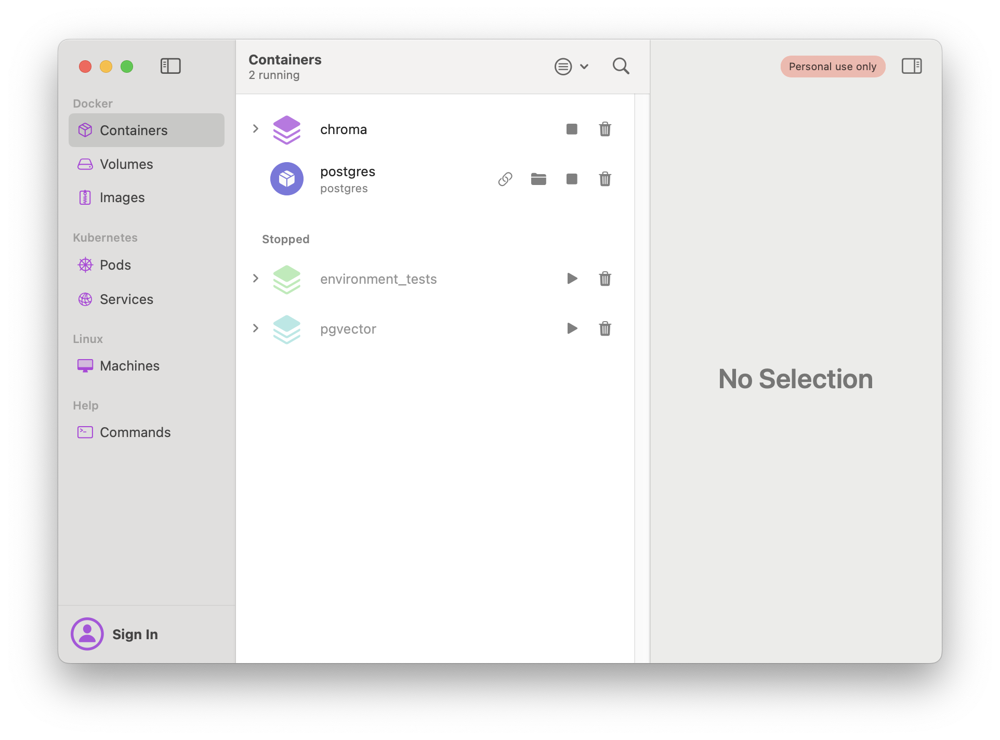

# Running locally

If you wish to run this 100% locally, you'll need to update a few pieces of the code, and download extra software. Because this application was built on top of the LangChain framework, modifying the code to run locally is simple.

## Requirements

To run locally, we'll employ [Ollama](https://ollama.com) for LLM inference and embeddings generation. For the vector store we'll use [Chroma](https://www.trychroma.com/), a free open source vector store. For the record manager, we'll use a simple PostgreSQL database. And finally, to run Chroma and PostgreSQL you'll need to install Docker.

## Steps

### Docker

To download and manage Docker containers with a GUI, you can download OrbStack [here](https://orbstack.dev/download). Once setup, we can install Chroma and PostgreSQL.

### Chroma

To download and start a Docker container running Chroma, first clone the official Chroma repository:

```shell
git clone git@github.com:chroma-core/chroma.git
```

Next, navigate into the cloned repository and start the Docker container:

```shell
cd chroma
docker-compose up -d --build
```

That's it! Now, if you open OrbStack you should see a container named "Chroma" running.


### PostgreSQL

First, pull the PostgreSQL image:

```shell
docker pull postgres
```

Then, run this command to start the image.

```shell
docker run --name postgres -e POSTGRES_PASSWORD=mysecretpassword -d postgres
```

Change "mysecretpassword" to your desired password.

Once finished you should see a second container running in OrbStack named "postgres"



### Ollama

To download Ollama, click [here](https://ollama.com/download) and select your operating system to download. Follow along with their onboarding setup.

Next, download the following models:

- [**mistral**](https://ollama.com/library/mistral): This model will be used for question rephrasing and answer generation.
- [**nomic-embed-text**](https://ollama.com/library/nomic-embed-text): We'll use this model for embeddings generation.

## Code changes

### Ingest script

To update your ingest script to run using Chroma and your locally running PostgreSQL image, you only need to modify a few lines of code. First, navigate to the [`./backend/ingest.py`](./backend/ingest.py) file.

Then, find the `ingest_docs` function and update the first few lines to instead pull from your new DB environment variables:

```shell
DATABASE_HOST="127.0.0.1"
DATABASE_PORT="5432"
DATABASE_USERNAME="postgres"
DATABASE_PASSWORD="mysecretpassword"
DATABASE_NAME="your-db-name" # Replace this with your database name.
```

```python
DATABASE_HOST = os.environ["DATABASE_HOST"]
DATABASE_PORT = os.environ["DATABASE_PORT"]
DATABASE_USERNAME = os.environ["DATABASE_USERNAME"]
DATABASE_PASSWORD = os.environ["DATABASE_PASSWORD"]
DATABASE_NAME = os.environ["DATABASE_NAME"]
RECORD_MANAGER_DB_URL = f"postgresql://{DATABASE_USERNAME}:{DATABASE_PASSWORD}@{DATABASE_HOST}:{DATABASE_PORT}/{DATABASE_NAME}"
```

For our vector store database, we'll want to set one more environment variable to track our collection name (similar to the index name for Weaviate):

```shell
COLLECTION_NAME="your-collection-name" # Change this to your collection name
```

Next, remove the Weaviate code below and replace with a Chroma DB instantiation:

```python
from langchain_community.vectorstores import Chroma


COLLECTION_NAME = os.environ["COLLECTION_NAME"]

vectorstore = Chroma(
    collection_name=COLLECTION_NAME,
    embedding_function=embedding,
)
```

For the record manager, you'll also need to create a database inside your PostgreSQL container:

```shell
docker exec -it postgres createdb -U postgres your-db-name
```

Then, update the record manager namespace:

```python
record_manager = SQLRecordManager(
    f"weaviate/{COLLECTION_NAME}", db_url=RECORD_MANAGER_DB_URL
)
```

Next, find the `get_embeddings_model` function inside the [`./backend/ingest.py`](./backend/ingest.py) file and replace its contents with an [`OllamaEmbeddings`](https://python.langchain.com/docs/integrations/text_embedding/ollama) instance:

```python
from langchain_community.embeddings import OllamaEmbeddings

def get_embeddings_model() -> Embeddings:
    return OllamaEmbeddings(model="nomic-embed-text")
```

Finally, you can delete the Weaviate specific stats code at the bottom of the file (this is just for logging info on how many items are stored in the database).

### API Endpoints

Next, we need to update the API endpoints to use Ollama for local LLM inference, and Chroma for document retrieval.

Navigate to the [`./backend/chain.py`](/backend/chain.py) file containing the chat endpoint.

Then, replace the Weaviate specific code a Chroma vectorstore:

```python
from langchain_community.vectorstores import Chroma

vectorstore = Chroma(
    collection_name=COLLECTION_NAME,
    embedding_function=embedding,
)
```

Finally, scroll to the bottom of the `chain.py` file and replace the `llm` variable with a single llm variable instantiation:

```python
from langchain_community.llms import Ollama

llm = Ollama(model="mistral")
```

Now you're done!